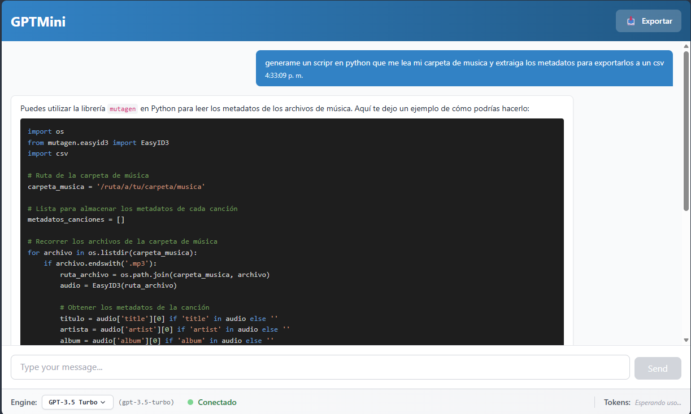

# GPTMini

A local ChatGPT-like application with a .NET backend and React frontend.

## 📸 Screenshots



*GPTMini mostrando una conversación con resaltado de sintaxis para código Python*

## Project Structure

```
GPTMini/
├─ backend/          # ASP.NET Core API
├─ frontend/         # React + TypeScript + Vite + Tailwind CSS
└─ README.md
```

## Features

- 💬 Chat interface similar to ChatGPT
- � **Historial de chats** con auto-guardado en LocalStorage
- 🔍 **Búsqueda de chats** por título o contenido
- 📎 **Adjuntar archivos** (imágenes, PDFs, DOCX, TXT)
- 🖼️ **Análisis de imágenes** con GPT-4 Vision API
- 📋 **Paste de imágenes** (Ctrl+V) directo desde portapapeles
- 🎯 **Drag & Drop** de archivos
- �🔌 RESTful API backend with ASP.NET Core
- ⚛️ Modern React frontend with TypeScript
- 🎨 Beautiful UI with Tailwind CSS
- 🔄 Real-time chat responses
- 📊 Token usage tracking
- 💾 Export chat to TXT or Markdown
- 🔒 Secure API key management

## Prerequisites

- .NET 8.0 SDK
- Node.js 18+ and npm
- OpenAI API key

## 🚀 Inicio Rápido

### Opción 1: Usar el Script Automático (Recomendado)

```powershell
# Desde la raíz del proyecto
.\EJECUTAR.ps1
```

### Opción 2: Configuración Manual

#### 1. Configurar Backend

```powershell
cd GPTMini\backend

# Opción A: Usar variable de entorno (Recomendado)
$env:OPENAI_API_KEY="sk-tu-api-key-aqui"

# Opción B: Crear appsettings.Development.json
# Copia appsettings.Development.json.example y reemplaza "sk-tu-api-key-aqui" con tu API key real

# Restaurar dependencias
dotnet restore

# Ejecutar
dotnet run
```

El backend estará en `http://localhost:5000` o `https://localhost:5001`

#### 2. Configurar Frontend (en otra terminal)

```powershell
cd GPTMini\frontend

# Instalar dependencias
npm install

# Ejecutar
npm run dev
```

El frontend estará en `http://localhost:5173`

## � Uso

1. ✅ Asegúrate de tener tu API key de OpenAI configurada
2. ✅ Inicia el backend (debe estar ejecutándose primero)
3. ✅ Inicia el frontend
4. ✅ Abre `http://localhost:5173` en tu navegador
5. 💬 ¡Comienza a chatear!

### 🎯 Funcionalidades Principales

**Historial de Chats:**
- Los chats se guardan automáticamente en tu navegador
- Máximo 100 chats, auto-eliminación después de 30 días
- Búsqueda por título o contenido
- Renombrar y eliminar chats
- Títulos auto-generados del primer mensaje

**Adjuntar Archivos:**
- 📎 Click en el botón de adjuntar
- 📋 Ctrl+V para pegar imágenes del portapapeles  
- 🎯 Arrastra y suelta archivos en la caja de texto
- Máximo 2 archivos por mensaje, 10MB total
- Tipos soportados:
  - Imágenes: PNG, JPEG, JPG, GIF, WEBP (análisis con Vision API)
  - Documentos: PDF, DOCX, TXT (preparados para Fase 2)

## 📝 Documentación Detallada

Para instrucciones más detalladas, consulta [INSTRUCCIONES.md](./INSTRUCCIONES.md)

## Configuration

### Backend

- API key: Set via `.env` file or `OPENAI_API_KEY` environment variable
- Model: Configure in `appsettings.json` (default: `gpt-3.5-turbo`)
- CORS: Configured to allow requests from frontend ports

### Frontend

- API endpoint: Configured in `vite.config.js` to proxy to backend
- Styling: Tailwind CSS with custom color palette

## Development

### Backend
- Built with ASP.NET Core 8.0
- Uses dependency injection for services
- Swagger UI available at `/swagger` in development mode

### Frontend
- Built with React 18, TypeScript, and Vite
- Uses Tailwind CSS for styling
- Custom hooks for chat functionality
- Component-based architecture

## License

MIT


